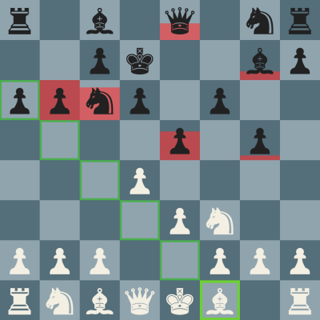

# Kungfu Chess

[Live][gh-pages]

[gh-pages]: matthewjf.github.io/kungfuchess

Kungfu Chess is chess without turns. A copy of the original [Kung-Fu Chess](https://en.wikipedia.org/wiki/Kung-Fu_Chess) made my Shizmoo Games.

## How to Play

Click start to begin a game.

Click a piece to select it and click the target position to move it. Any available piece can be moved at any time.

A delay starts at the end of a piece's move. During this delay, a piece is unavailable to move until the delay is over. The delay amount is determined by the selected speed setting.

The game ends when either King is taken.



## Technology

- JavaScript
- Jquery
- CSS

### Game

Built on vanilla JavaScript with jQuery and CSS for animations.

### Animations

In order to make the animation work using CSS transition, each piece belongs to it's own div that sits above the grid. Each piece and square on the grid uses it's own click handler to manage user inputs. Pieces are moved around the grid using jQuery. An additional div is attached to the piece to show the countdown timer with a transition.

`Display` move function:

```javascript
function renderPieceMove(startPos, endPos, completionCB, timerAmount) {
  var $piece = $('div[pos="' + startPos[0] + ',' + startPos[1] + '"]');

  var top = 60 * endPos[0];
  var left = 60 * endPos[1];

  $piece.css({top: top + 'px', left: left + 'px'});
  $piece.attr('pos', endPos);

  if (completionCB) {
    setTimeout(function(){
      completionCB(endPos, timerAmount);
    }, Constants.MoveTime);
  }
}
```

### Piece Movement

At the beginning of a piece's move, it is set to not be moveable by a player. A piece will recursively step through each square in it's path until it either takes another piece or reaches it's target destination.

This allows pieces to be intercepted by other pieces by either blocking it's movement or even taking the piece while it exists on a square.

###### Notes:
- Knights do not traverse squares and cannot be intercepted
- Pawns are automatically promoted to Queens
- A piece may be intercepted by the piece it is attacking (timing this is difficult)
- En passant does not work after a move (you must take it during its move)


### AI Player

Currently, only single player mode is supported. Black is played by the computer.

The AI runs 2 intervals to make moves. One interval runs every half second and attempts to protect the king with the following logic:

- If a piece threatens the king, the AI will attempt to take the piece
- If it cannot take the piece, it will attempt to move the king to a safe position

The second interval will move other pieces according to the following logic and runs every second:

- Take the opponent's King if any piece can
- Take a black piece if any piece can
- Select a random piece and make a random move for that piece
